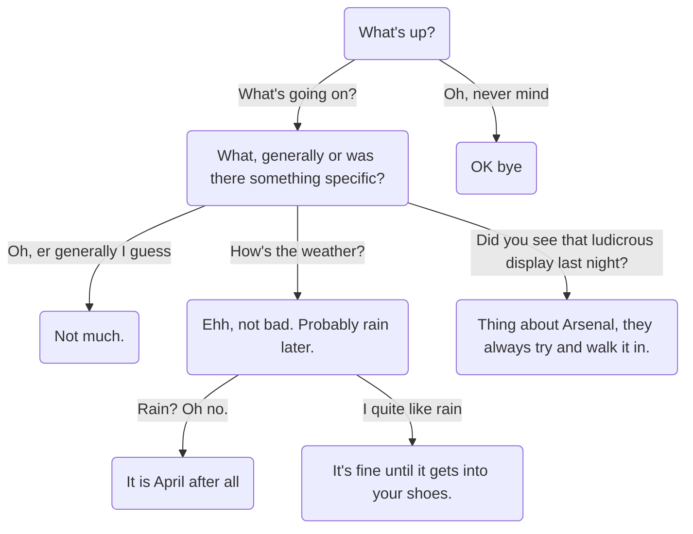
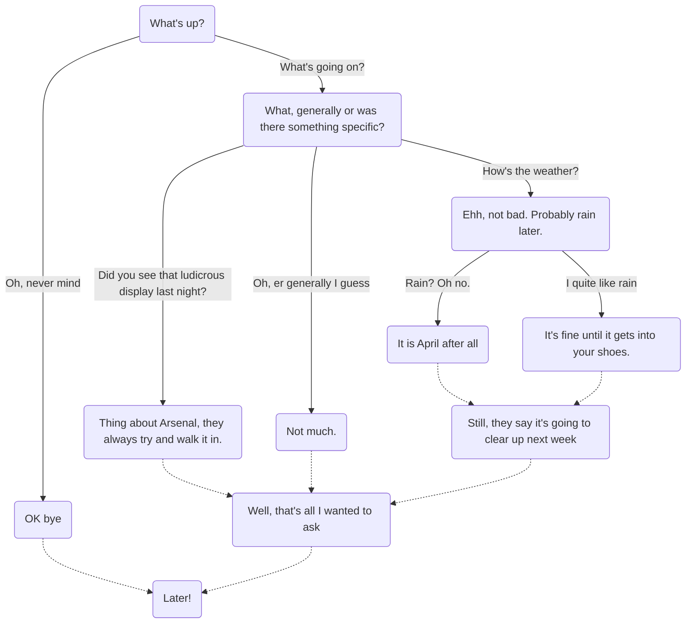

# Choice Lines

When speaker lines follow each other, the dialogue follows a linear sequence. 
It's assumed that you'll provide a "continue" button in your game to advance to 
the next line. 

When you want the player to make a decision and branch the dialogue, or even if 
you just want some text associated with a single continuation, then you need a *choice line*.

Choice lines begin with an asterisk, and must be contained on the rest of the line.
In the example below, there are 3 choices following the first dialogue line:

```yaml
Vagabond: Well met, fellow traveller!
  * Er, hi?
    Vagabond: Verily, 'tis wondrous to see such a fine fellow on the road this morn!
  * (Keep quiet)
    Vagabond: What, cat got your tongue?
  * Jog on, mate
    Vagabond: Well, really! Good day then sir!
Narrator: (The Vagabond leaves)
```

Underneath each choice, you put the follow-on lines that will be taken if this choice
is selected. These lines ***must be indented*** to at least one character inward of
the asterisk itself (I recommend 2 or 4).

Any type of line can be included in these indented follow-on sections, including
other choices (although there must be a speaker line in between, see below).
You can nest as far as you wish, although it may become unwieldy eventually,
and you'd be better to use a [goto](GotoLines.md).

```yaml
NPC: What's up?
  * What's going on?
    NPC: What, generally or was there something specific?
      * Oh, er generally I guess
        NPC: Not much.
      * How's the weather?
        NPC: Ehh, not bad. Probably rain later.
          * Rain? Oh no.
            NPC: It is April after all
          * I quite like rain
            NPC: It's fine until it gets into your shoes.
      * Did you see that ludicrous display last night?
        NPC:  Thing about Arsenal, they always try and walk it in.
  * Oh, never mind
    NPC: OK bye
```

This is where you can see why the indenting is important. All the asterisks at
the same level of indenting are part of the same set of choices, while everything
indented further is part of one of the choice branches, which can be nested. 

This example creates a dialogue tree that could be visualised like this:



You might be wondering what happens when the dialogue reaches the end of a
choice section, if there's no [goto](GotoLines.md) line sending it somewhere else. 
That's covered later in the [fallthrough section](#fallthrough).

## Choices And Speaker Lines

Choices must ***always*** follow on from a [speaker line](SpeakerLines.md), they can't
exist on their own. Usually choices will be directly underneath a speaker line, and for 
readability we recommend some kind of indent. However, choices can also follow on from a speaker line via a 
[goto](GotoLines.md):

```yaml
Shopkeep: What will it be?
  :choices
  * What's that knobbly thing?
    Shopkeep: That would be potato, sir. 
    [goto choices]
  * One jelly baby if I may, ideally green
    Shopkeep: One??
    ...
```

In this case, note that the `:choices` label is directly above the choices,
rather than above the speaker line. This means that when we `[goto choices]`
just after the "That would be a potato, sir" line, the choices are used as 
continuations from that line, and we don't have to repeat the original "What will it be"
line that started off the sequence. It's good for looping dialogue, letting you
re-present the same list of choices but in the context of the last dialogue line.

## Variable Substitution

In the text sections of a choice, you can substitute the values of [variables](Variables.md)
using curly braces (`{}`), something like this:

```yaml
  * Did you see {SuspectName} on the night of July 3rd?
```

For more information, see [Text Markup](TextMarkup.md).

## Fallthrough

What happens when you reach the end of a choice branch, and there's no [goto](GotoLines.md)
sending the execution somewhere else?

In that case dialogue execution "falls through" to the next line which is outdented
more than the current line, and is on the same "choice path" (i.e. it doesn't
cross to a place where you'd have had to pick a different choice to get there).

Let's take the previous example and add some additional lines as intermediate fallthrough points
(the previous example would have fallen through to the end in every case).

```yaml
NPC: What's up?
  * What's going on?
    NPC: What, generally or was there something specific?
      * Oh, er generally I guess
        NPC: Not much.
      * How's the weather?
        NPC: Ehh, not bad. Probably rain later.
          * Rain? Oh no.
            NPC: It is April after all
          * I quite like rain
            NPC: It's fine until it gets into your shoes.
        NPC: Still, they say it's going to clear up next week
      * Did you see that ludicrous display last night?
        NPC:  Thing about Arsenal, they always try and walk it in.
    Player: Well, that's all I wanted to ask.
  * Oh, never mind
    NPC: OK bye
Player: Later!
```

Let's update that flowchart to show where the fallthroughs happen:



The fallthrough points are shown by dotted lines. To follow how this works, 
let's take an inner snippet; Let's say we're on the line indicated by the arrow, "It is April after all":

```yaml
        NPC: Ehh, not bad. Probably rain later.
          * Rain? Oh no.
----->      NPC: It is April after all
          * I quite like rain
            NPC: It's fine until it gets into your shoes.        
        NPC: Still, they say it's going to clear up next week
```

When we continue, we find there's no more lines under this choice, so we fall
through to the next outdented line that is NOT on a different choice path.
So even though "I quite like rain" is outdented, it's a different choice path, 
so we skip it. 

The next line that's outdented but on the same choice path is the speaker line
"Still, they say it's going to clear up next week".

```yaml
        NPC: Ehh, not bad. Probably rain later.
          * Rain? Oh no.
   .-----   NPC: It is April after all
   |      * I quite like rain
   |        NPC: It's fine until it gets into your shoes.        
   `->  NPC: Still, they say it's going to clear up next week
```

You can fallthrough to lines other than speaker lines, including [Set lines](SetLines.md), 
[Goto lines](GotoLines.md), [Event lines](EventLines.md). 

When there's nothing left to fall through to, the dialogue ends.

### Conditionals and fallthroughs

Lines in one [Conditional Block](ConditionalLines.md) can only fall through to 
lines which are in the same block, or in a containing block (including outside 
any conditional).

## Lines *between* Speaker and Choice Lines

It's perfectly valid to put additional non-speaker lines between speaker lines 
and the choices, for example:

```yaml
Player: Hello
[set SomeVar 3]
  * Choice 1
    NPC: You picked 1
  * Choice 2
    NPC: You picked 2
```

When there's no choices, lines following a speaker line won't be executed until
the player proceed onwards from that speaker line. But, when there are choices, because the choices
are evaluated as *part of the speaker line* (since they have to be displayed with it),
any lines in between like this will be evaluated immediately.

So you could, for example, do something which was dependent on those lines in the 
choices themselves, such as a [Conditional](ConditionalLines.md):

```yaml
Player: Hello
# The following set will be executed as part of the speaker line, 
# because dialogue goes through it to find the choices
[set SomeVar 3]
  * Choice 1
    NPC: You picked 1
  * Choice 2
    NPC: You picked 2
  [if {SomeVar} > 0]
  * Choice 3
    NPC: This choice WILL be available
  [endif]
```

This is subtly different timing compared to if that `set` line was
between 2 speaker lines, but since choices are an *extension* of the speaker line
it makes sense that anything in between is evaluated as the dialogue collates 
the choices for use while playing the speaker line.

If you find it confusing, just don't put set/event etc lines in between speaker
lines and choices. But it can be very useful, for example for cases when you
use [goto](GotoLines.md) or [gosub](GosubLines.md) to go back to common choices
and you want to set something just before that.

## Choices as Speaker Lines

By default, choices are not "spoken"; they don't get repeated as speaker lines
after being selected. That's because most often you'll want shorter choice text 
to fit in your UI, and you can follow up with a longer speaker line that represents
that choice.

But, what if you want the choice to be the full text that the player speaks?
You could simply duplicate the choice text in a speaker line directly afterwards,
but that gets tedious to do, and duplicates the text to localise.

Instead, you can tell SUDS to generate a speaker line directly after each choice
by default, with the same text as the choice. There are 2 ways to do this:

1. In Project Settings > SUDS Editor, set "Always Generate Speaker Lines From Choices" to true.
2. In a script, use `[importsetting GenerateSpeakerLinesFromChoices true]` in the [Header Section](Header.md)

These settings only apply on *importing a script*, so if you change the global setting,
you'll need to re-import any `.sud` script you want the change to apply to.

### Disabling Speaker Lines for Individual Choices

If you use the option to generate speaker lines from choices, you'll sometimes
want to *not* do that for certain choices. To disable the generation of speaker
lines for a choice, use the prefix `*-` instead of the usual `*`. E.g.

```yaml
NPC: Hello
  * This is a speaker line choice
    NPC: The player spoke the previous line
  *- This choice is not a speaker line
```

### Setting the SpeakerID for Choice Lines

By default the SpeakerID for speaker lines generated from choices is "Player",
but you can override this:

1. In Project Settings > SUDS Editor, set "Speaker ID For Generated Lines From Choices".
2. In a script, use ``[importsetting SpeakerIDForGeneratedLinesFromChoices `Speaker`]`` in the [Header Section](Header.md)


> Note: You *can* actually use `[importsetting ...]` outside the [Header Section](Header.md)
> if you *really* need to. However, be careful; changing `importsetting` values apply
> **for all lines** below that one. Indenting does not matter for `importsetting`.
> So, put it in the header if you can for simplicity.

---

### See Also:
* [Text Markup](TextMarkup.md)
* [Speaker lines](SpeakerLines.md)
* [Script Reference](ScriptReference.md)
* [Variables](Variables.md)
* [Running Dialogue in UE](RunningDialogue.md)
* [Localisation](Localisation.md)
* [Full Documentation Index](../Index.md)