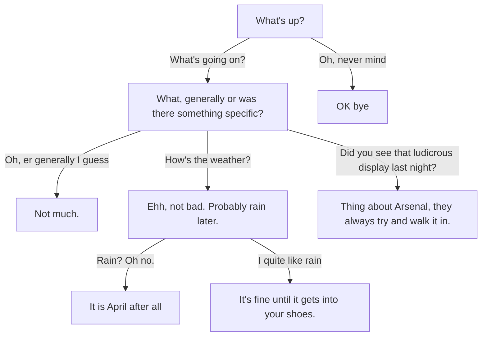

# Choice Lines

When speaker lines follow each other, the dialogue follows a linear sequence. 
It's assumed that you'll provide a "continue" button in your game to advance to 
the next line. 

When you want the player to make a decision and branch the dialogue, or even if 
you just want some text associated with a single continuation, then you need a *choice line*.

Choice lines begin with an asterisk, and must be contained on the rest of the line.
In the example below, there are 3 choices following the first dialogue line:

```yaml
Vagabond: Well met, fellow traveller!
  * Er, hi?
    Vagabond: Verily, 'tis wondrous to see such a fine fellow on the road this morn!
  * (Keep quiet)
    Vagabond: What, cat got your tongue?
  * Jog on, mate
    Vagabond: Well, really! Good day then sir!
Narrator: (The Vagabond leaves)
```

Underneath each choice, you put the follow-on lines that will be taken if this choice
is selected. These lines ***must be indented*** to at least one character inward of
the asterisk itself (I recommend 2 or 4).

Any type of line can be included in these indented follow-on sections, including
other choices (although there must be a speaker line in between, see below).
You can nest as far as you wish, although it may become unwieldy eventually,
and you'd be better to use a [goto](GotoLines.md).

```yaml
NPC: What's up?
  * What's going on?
    NPC: What, generally or was there something specific?
      * Oh, er generally I guess
        NPC: Not much.
      * How's the weather?
        NPC: Ehh, not bad. Probably rain later.
          * Rain? Oh no.
            NPC: It is April after all
          * I quite like rain
            NPC: It's fine until it gets into your shoes.
      * Did you see that ludicrous display last night?
        NPC:  Thing about Arsenal, they always try and walk it in.
  * Oh, never mind
    NPC: OK bye
```

This is where you can see why the indenting is important. All the asterisks at
the same level of indenting are part of the same set of choices, while everything
indented further is part of one of the choice branches, which can be nested. 

This example creates a dialogue tree that could be visualised like this:



You might be wondering what happens when the dialogue reaches the end of a
choice section, if there's no [goto](GotoLines.md) line sending it somewhere else. 
That's covered later in the [fallthrough section](#fallthrough).

## Choices And Speaker Lines

Choices must ***always*** follow on from a [speaker line](SpeakerLines.md), they can't
exist on their own. Usually choices will be directly underneath a speaker line, and for 
readability we recommend some kind of indent. However, choices can also follow on from a speaker line via a 
[goto](GotoLines.md):

```yaml
Shopkeep: What will it be?
  :choices
  * What's that knobbly thing?
    Shopkeep: That would be potato, sir. 
    [goto choices]
  * One jelly baby if I may, ideally green
    Shopkeep: One??
    ...
```

In this case, note that the `:choices` label is directly above the choices,
rather than above the speaker line. This means that when we `[goto choices]`
just after the "That would be a potato, sir" line, the choices are used as 
continuations from that line, and we don't have to repeat the original "What will it be"
line that started off the sequence. It's good for looping dialogue, letting you
re-present the same list of choices but in the context of the last dialogue line.

### Fallthrough
