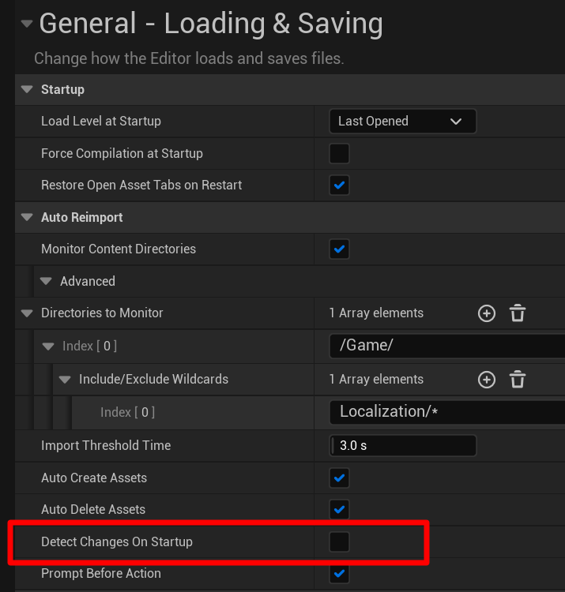

# FAQ

## Importing

### Why do I suddenly see "Strings" files in the Content Browser?

For a little while since UE 5.3, the String Table files associated with each script were not visible in the Content
Browser. This is because SUDS used to embed the String Table in the same .uasset file as the Script asset itself, 
which was kind of convenient, but as of 5.3 they stopped showing in the browser. That was fine because you usually don't
need to know about them, since they're auto-generated from the script.

However, we discovered recently that there are some edge cases with storing the String Tables like this, and although
UE supports it, nothing in the core engine uses that feature. There is an option in Project Settings > Plugins > SUDS Editor
called "Create String Tables As Separate Packages" which is now defaulted to TRUE, which causes all *imported* scripts
to generate separate Strings files. You'll get that even if you re-import an old script which didn't used to have a
separate Strings file.

While you don't currently *need* to reimport all your scripts to create the separate strings files, this is now the default
going forward to avoid these rare edge cases (one of which was calling `CollectGarbage(RF_None)` in your own editor code
could cause scripts to disappear until you restarted the editor - don't ask, we don't know why).

### When using Source Control, I get prompted to re-import other people's changes to .sud files

> This sucks! I've actually [submitted a Pull Request](https://github.com/EpicGames/UnrealEngine/pull/10006)
> to fix this issue, so that hopefully in future this won't be a problem.

If you're using source control, one person will be writing the `.sud` file and
probably importing it into a `.uasset` as well, and adding both to source control.

However, when someone else gets both these files from source control, it's 
possible that UE will prompt them to re-import the `.sud` file, thinking it has
changed - even though it's the same one that the other person used to import the
asset.

Unfortunately this is a general problem with how Unreal detects changes in source
files for re-importing when the source is also store in source control. 

The [official UE docs](https://docs.unrealengine.com/5.1/en-US/reimporting-assets-automatically-in-unreal-engine/)
cover this scenario, and advise to turn off the editor setting "Detect Changes on Restart"
(actually this is now called "Detect Changes on Startup"):

> Basically, UE can't tell that the source file on disk is the same one used to
> create the asset that's been imported by someone else. UE caches file hashes to
> avoid imports, but it only does so for things it's imported itself at some point
> in the past. If someone else did it, the hash won't be in the cache and it'll
> just go by the fact that the timestamp is later than the last it knew about.
> I've picked over the asset reimport code and can't see any way of making it use
> a hash in the uasset to compare, the custom asset import code doesn't seem to have
> any access to the decision about whether to prompt to reimport.

Changing this setting will fix the problem, but has the side effect of making UE
only prompt you to re-import assets that you update *while the editor is running*.
If you're in the habit of changing source files then starting UE, you'll no longer
get the auto-import prompt for this.

### How do I resolve merge conflicts with SUDS files?

Because SUDS assets are entirely imported from the text `.sud` file, if you have
merge conflicts you only have to resolve them in the `.sud` file itself, then
reimport the asset using that resolved version.

### See Also:
* [Script Reference](ScriptReference.md)
* [Full Documentation Index](../Index.md)