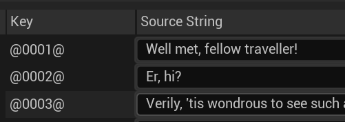
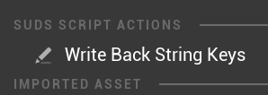

# Localisation

Once you get to the point where your script is pretty nailed down, you're probably
going to want to translate it into other languages.

SUDS piggy-backs on the existing Unreal Engine localisation process. The text from
[Speaker Lines](SpeakerLines.md), [Choice Lines](ChoiceLines.md) and 
literal text in [Set Lines](SetLines.md) is extracted and placed in a
[String Table asset](https://docs.unrealengine.com/5.1/en-US/using-string-tables-for-text-in-unreal-engine/).
There is always one string table asset for each [script asset](ScriptReference.md),
and it's re-generated every time its imported.

String tables are simple key/value stores, and you can use the 
[Unreal Localisation Dashboard](https://docs.unrealengine.com/5.1/en-US/localization-tools-in-unreal-engine/)
to include those in your localisation effort. 

The caveat is that the keys used for those string tables have, so far, not been
something you've concerned yourself with. This is where [String Keys](#string-keys)
come in.

## String Keys

By default, the keys for text in the string table are automatically generated at
import time. You can open the string table if you want to see them: 



The keys are in fact generated sequentially (although the numbers used are
hexadecimal), with "`@`" characters around them just to act as markers (more on
why later). While the generation at import is deterministic, if you change the
ordering of lines or insert / delete lines, those numbers will change.

That isn't actually a problem until you start localising, or making use 
of these keys in other ways (such as [saving the current position](SavingState.md)).
Once you start doing that, it's important that these String Keys stay the same,
which they won't if you make changes such as removing or adding lines. 

Now, once you start localising you probably shouldn't be making changes like this
anyway, since those changes would affect the translations too. But, in the real 
world you might have a need to do this. 

### Handling changes after strings are locked down

[Speaker Lines](SpeakerLines.md), [Choice Lines](ChoiceLines.md) and 
[Set Lines](SetLines.md) with literal text in them can actually have the String Key
specified at the end of the line, like this:

```yaml
NPC: This is a line that has been localised!   @00f3@
```

When the importer sees that `@00f3@` pattern, it knows to use that as the key
for this string, instead of generating one. That makes it safe to make edits to
this script even if localisation has already started (so long as you notify your
translators if it affects their work!).


Now, you don't want to have to add those markers yourself, it would be very boring.
So, SUDS provides an automated way to add them.

Right-click on one or more SUDS script assets in the Content Browser and select 
"Write Back String Keys":



Provided the `.sud` file you used to create the asset can be found in the same 
location you previously imported it from, this will write back all the string
keys from the string table on the end of each line it came from (it validates 
that the text still matches). From then on you can safely make small edits to
your original `.sud` file and know that the keys will stay the same. 

> Note 1: Writing back the keys will make UE prompt you to re-import the script,
> which you should accept so it updates the asset hash / timestamps. It also
> proves that it works to re-import the keys.

> Note 2: In a perfect world, you would just never change your `.sud` files once
> you got to the stage where you start localising, so you'd never need this
> feature. But, this feature is here because we don't live in that world. 😉

> Note 3: It's easiest just to save `.sud` files somewhere in your content directory,
> and store them in your source code repository alongside the `.uasset` they created.
> That way the relative import path is very simple so this tool can easily find them.


## De-duplication, or the lack thereof

You might be wondering whether the import process does any de-duplication of strings,
both to save (a small amount of) space, and to make it so that the string only
gets included in translations once. 

SUDS does *not* do this; every string in your script is included separately. This is
for a couple of reasons:

1. Proper de-duplication would require de-duplicating across all scripts, which would
   introduce unnecessary complexity and dependencies between scripts. Changing a
   line in one script could affect whether another script could use the shared text etc.

2. Context is important. In one language, using the same line for 2 situations might
   be correct, but in another it might be ambiguous, or just not as good as having
   a slightly different wording. If SUDS de-duplicated at source, you'd always be forced to
   use the same translation in different contexts which may not be best.

Instead, every line has a unique string key, both within and across scripts.
Re-using translations can still be done downstream in the localisation process,
most tools provide help for this kind of thing and Unreal collates localised
strings from multiple assets at once so you can do this. But SUDS isn't going to force you
to use the same translated line in different circumstances, or weld together
different uses of the same text in different scripts that may be coincidental and
may change over time. I consider it better to keep the duplication at source to
maintain full flexibility and you can de-duplicate later in the translation stage 
if you want.

### See Also:
* [Script Reference](ScriptReference.md)
* [Running Dialogue](RunningDialogue.md)
* [Full Documentation Index](../Index.md)