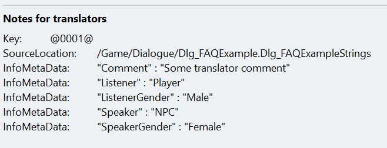

# Translator Comments for Localisation

Often when you're sending dialogue out for localisation, you'll need to include extra
context along with the lines so that your translators know exactly how to translate
it.

Luckily, the string tables SUDS stores all the lines in have support for extra
metadata. You can't see it when you open up a string table asset, but it's there.
When you export strings for localisation using the 
[Localization Dashboard](https://docs.unrealengine.com/5.1/en-US/localization-tools-in-unreal-engine/),
that extra metadata will be included in the .po files that you send to translators.

SUDS provides special comment syntax for adding translator comments and other
metadata.

## Automatic Metadata

### "Speaker"

SUDS automatically adds "Speaker" metadata to all speaker lines and choices.

For **speaker lines**, "Speaker" is set to the ID of the speaker. E.g.

SUDS source:

```yaml
Fred: Right
```

Metadata:
```
"Speaker" = "Fred"
```

For **choices**, the "Speaker" is always set to "Player (Choice)". The "(Choice)" suffix
is there to let your translators know that this is a choice rather than a spoken
line, which may therefore have less space for the translation.

## User-defined Translator Comments & Metadata

### Comments for the Next Line

The simplest way to add your own translator comments is to use the special 
comment prefix `#=`:

```yaml
#= This line is delivered jokingly, between friends
NPC: Oi, smeghead!
```

Comments with the `#=` prefix apply to the next line (speaker or choice) *only*.
When nothing else is specified, this comment goes into the "Comment" field in the 
metadata.

You can also specify other metadata fields, for example:

```yaml
#= This is a general comment, that will go into the "Comment" field
#= SpeakerGender: Male
#= ListenerGender: Female
Bob: I'm mansplaining again, aren't I?
```

In this case, that speaker line will have 3 fields, the general "Comment" and
also "SpeakerGender" and "ListenerGender" fields. You can use any Key you want,
the metadata is simply a key/value set.

> Note: Comments / metadata can only be on a single line. Later lines essentially 
> replace earlier ones.

### Scoped Comments

It would be tedious to have to supply comments like this for every single line
when the information is the same. However, translators typically want this 
information for every line, because once it's exported they'll be working just
on one big table of strings most of the time.

To make this easier, you can use an alternative form of translator comment, that
is prefixed with `#+` instead of `#=`. These comments apply to ALL lines
following them, until overridden, or they fall out of indenting scope.

The most basic example might be:

```yaml
#+ Tone: smug/arrogant. This comment applies until I say otherwise
Vizzini: But it's so simple. 
Vizzini: All I have to do is divine from what I know of you.
Vizzini: Are you the sort of man who would put the poison into his own goblet, or his enemy's?
```

All 3 of those lines would have the same comment applied. The same goes for any
custom metadata key you add, until you change it to another one.

### Indenting and Scoped Comments

Scoped comments also cease to apply when the script goes back up to a higher
indenting level. When that happens, the comment and metadata set only at indent levels
higher than this are used. For example:

```yaml
#+ This is comment A
Player: This line gets comment A
    * A choice, which also gets comment A
        NPC: As does this line
    #+ Indented comment B
    * This choice gets comment B
        #+ Even more indented comment C
        #+ NestedKey: This is only set in this nested scope
        NPC: This line will get comment C and NestedKey
    * Final choice gets comment B and NOT NestedKey, since it and C are out of scope
        NPC: This is getting comment B too
Player: This gets comment A
#+
Player: This gets no comment at all since reset above
```

> Note: Next-line comments (`#=`) always override scoped comments, but only for the 
> next line. After that if the scoped comments are still in scope they will be used.

## How it looks to a translator

Although you can't see the metadata in the string table, when you use the 
[Localization Dashboard](https://docs.unrealengine.com/5.1/en-US/localization-tools-in-unreal-engine/),
to export strings, they get included in the .po file, under the "InfoMetadata"
section.

If you open a .po like this up in POEdit, your translator will see something like
this when you select a line:



This should help them to understand the context of a given line.


### See Also:
* [Localisation](Localisation.md)
* [Script Reference](ScriptReference.md)
* [Running Dialogue](RunningDialogue.md)
* [Full Documentation Index](../Index.md)