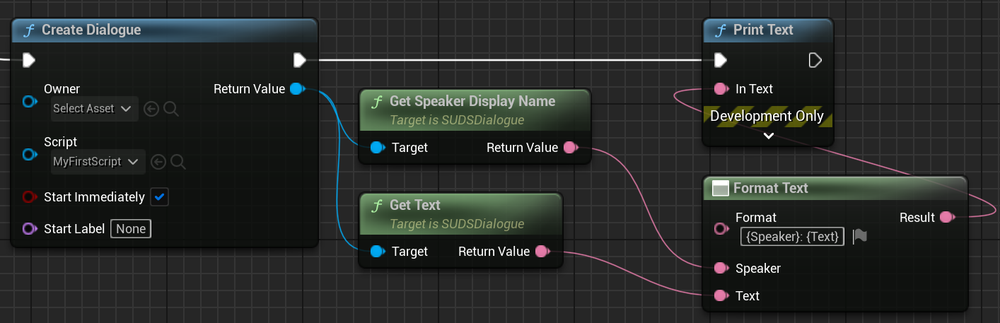
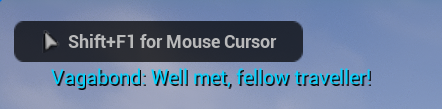

# Writing Your First Script

## Scripts and Dialogues

SUDS has two primary concepts: 

* **Script**: This is a sequence of dialogue lines, including all the possible routes through that dialogue. Think of it like a movie script.
* **Dialogue**: This is a runtime instance of a Script. The Dialogue essentially
    steps through the script based on choices the player makes. 

For this section, we're concerned only with writing the **Script**. We'll cover
[how to run Dialogues](RunningDialogue.md) later.

## Source Scripts and Unreal Assets

In SUDS you write the script as a text file, with the extension `.sud`. We'll 
call this the *SUDS Script Source File*.

When you save a file of type `.sud` inside your Unreal Engine content folder, 
the SUDS custom importer can import that source file into a *SUDS Script Asset*.
This is the same as if you put a PNG file in your content directory and imported it
into a Texture Asset. 


> In fact you get both a *Script Asset* and a *String Table*, which helps with [localisation](Localisation.md).

You'll always be writing your dialogue in SUDS Script Source Files in a text editor,
but at runtime you'll be using the SUDS Script Assets. They're small and efficient
because all the work to interpret them has already been done in the importer.

The [VSCode extension](vscode.md) means "SUDS" is a recognised language and will be
automatically used whenever you save a file with the `.sud` extension.
It's **highly recommended** to use VSCode with this extension as your script editing tool.

## Writing A Script

### Scripts Are Line Based

To keep things simple, SUDS scripts are line-based. Each line is considered as
a whole and does one thing. You can't split something over 2 lines, or combine
multiple statements into a single line. 

### Lines are trimmed at the start & end

You don't have to worry about whitespace at the start/end of your lines, it will be removed.
However indenting can matter when it comes to branching due to player choices, 
which we'll cover later.

### Speaker lines

The basic building block of a script is the *speaker line*. This is some kind of
speaker saying a line of dialogue, for example:

```yaml
Vagabond: Well met, fellow traveller!
```

In this case the *speaker* is "Vagabond", and the *text* is "Well met, fellow traveller!".
That's it, you've created your first script 😄. If you imported this single line
source script into Unreal and ran a dialogue based on it, it would issue that single line before ending.

#### Multi-line text

Speaker lines can have carriage returns in them. All plain text lines following 
a speaker line will append that text to the speaker line, with the carriage returns
preserved. Only encountering another type of line will terminate the string. 
For example:

```yaml
Vagabond: Well met, fellow traveller!
          How are you today?
Vagabond: What, cat got your tongue?
```

This represents 2 speaker lines issued one after the other, the first of which
has a carriage return in it. Notice how I've aligned the text - I didn't need to
do that, but I can if I want to make things neater because whitespace is trimmed. 

#### Speaker IDs vs Speaker Names

Technically the prefix "Vagabond" in the previous example is the *speaker ID*, not
the display name, but if you don't specify otherwise, that *speaker ID* is used
as the display name as well. 

One limitation is that Speaker ID's can't have whitespace in them. For this and 
other reasons (brevity, localisation) you might want to use a short internal term
for the speaker ID, and explicitly define 
[Speaker Display Names](SpeakerLines.md#speaker-display-names) for showing the
player. But we won't do that right now.

### Choice lines

Multiple speaker lines following each other simply require the player to 
step through them in sequence, but when you want to branch the dialogue based on
a decision by the player, you add *choice lines*.

```yaml
Vagabond: Well met, fellow traveller!
  * Er, hi?
    Vagabond: Verily, 'tis wondrous to see such a fine fellow on the road this morn!
  * (Keep quiet)
    Vagabond: What, cat got your tongue?
  * Jog on, mate
    Vagabond: Well, really! Good day then sir!
Narrator: (The Vagabond leaves)
```
> Note: unfortunately Markdown can't do the same syntax highlighting as the 
> [VSCode extension](vscode.md); I don't want to embed images all the time so
> just remember scripts will look much nicer in the editor than this; choices are
> colour-coded etc

Choice lines begin with an asterisk (`*`), much like a bullet point list in Markdown. 
Speaker lines look ahead to see if there are choices ahead (before the next speaker line) 
and if so add choices to the next step. Technically you *can* have
a single choice line, which means there's no branch in the dialogue, but 
adds text to the only forward choice.

Choice lines don't *have* to be indented from the text but it's neater to do so.
Everything following the asterisk is the text to be displayed to the player as
the choice option. 

When a player picks one of those option, the lines underneath the choice line
are run. These lines *must be indented* to at least one character inward of
the asterisk. You can embed as many lines as you want in there, and of course
other choices. You can nest as deeply as you want, although it gets a bit unwieldy
eventually and you'll probably want to use a `goto` (see below).

When you run out of lines in a nested section, dialogue "falls through" to the
next less indented line on the same narrative path. So in this case, all 3
choices will show one unique speaker line, then fall through to the "Narrator" line
at the end.

### Comments

You can include [comments](CommentLines.md) in your script by starting the line
with a hash/pound (`#`) character:

```yaml
# This is a Comment
NPC: Did you say something?
```

### Goto lines

Sometimes you just want to jump the conversation somewhere else. 
Goto lines are one of the many *instruction lines* which start and end with square
brackets (`[]`):

```yaml
[goto <Label>]
```

Where `<Label>` is the name of a label you've defined somewhere else in the
script, or `end` (which terminates the dialogue).

Labels are defined on their own lines like this:

```yaml
:SomeLabel
```

Here's an example of it in action:

```yaml
Vagabond: Well met, fellow traveller!
  * Er, hi?
    Vagabond: Verily, 'tis wondrous to see such a fine fellow on the road this morn!
    [goto FriendlyChat]
  * Jog on, mate
    Vagabond: Well, really! Good day then sir!
    [goto end]

:FriendlyChat
Vagabond: Mayhaps we could travel together a while, and share a tale or two?
```

> You can actually `goto` any line, not just a speaker line. For example if you
> `goto` a choice line after a speaker line, it will append the choices after the
> `goto` to that speaker line as if the choices were directly under it. This 
> is very useful for making looping dialogue.

### There's Much More!

There are plenty of other features which we don't have time for in this simple 
version, take a look at [the script reference](ScriptReference.md) for details.

For now, we're going to crack on just with this simple set and get it up and
running in Unreal.

### Importing the Dialogue

Now that you've written your first script, save the `.sud` file under your 
Unreal project's Content directory somewhere. If you have auto-importing enabled
you'll get a prompt saying that source content changes have been detected, and
offer to import them, to which you should click "Import".

If not, or if you want to keep your `.sud` files elsewhere, click the "Import"
button at the top of the Content Browser and browse to your `.sud` file to
import it. 

You should have 2 new assets, a "SUDS Script" asset named the same as your
source file, and a String Table asset named the same but with a "Strings" suffix.

### Testing Dialogue

You can double-click on the imported script asset to open the 
[in-editor dialogue tester](Testing.md).

### Running Dialogue In Your Game

Here's the absolute simplest way to create a dialogue using this script and
display the first line using Blueprints:



The "Create Dialogue" node creates a runtime dialogue from the script,
and  immediately starts it from the beginning. This causes the dialogue to start
running lines from the top, and when it hits a speaker line it stops (there
are delegates you can use to be notified of and influence this).

We just print out the first line, which predictably leads to this:



Of course, that's just one line. From here you'd need to tell the dialogue to
continue, or pick choices and so on. For more details about this process, 
see [Running Dialogue](RunningDialogue.md).

## SUDS Example Project

If you want to see a fully worked example of using SUDS in practice, see
the [SUDS Example Project](https://github.com/sinbad/SUDSExample).

---

### Next:
* [Script Reference](ScriptReference.md)
* [Testing Scripts](Testing.md)
* [Running Dialogue in UE](RunningDialogue.md)
* [SUDS Example Project](https://github.com/sinbad/SUDSExample)
* [Full Documentation Index](../Index.md)
* [Frequently Asked Questions](docs/FAQ.md)