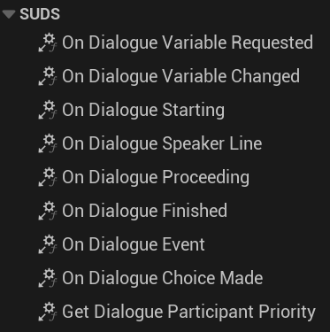
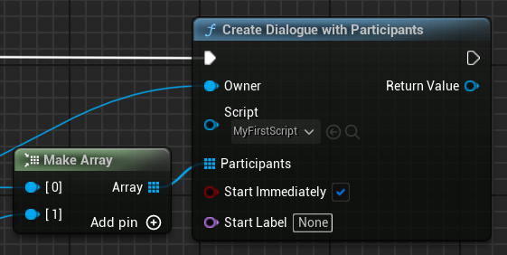

# Participants

**Participants** are game objects which have a close association with a runtime
dialogue; most likely objects like your player character, and the characters they're
talking to.

Participants are likely to:

* Own the dialogue instance (one of them, probably the NPC)
* Provide and retrieve [variables](Variables.md) from the dialogue
* Receive [events](EventLines.md) from the dialogue

In order to do this, participant objects need to implement the `ISUDSParticipant`
interface, and override whichever methods they need to from that interface:

> While it's possible for any other object to do all of the things above as well,
> in the case of events there are matching delegates for everything in `ISUDSParticipant`,
> it's better to make a Participant in these cases, because you have more control
> over the order of invocation.
> 
> Participants are guaranteed to be called in a known order based on their return
> value from `GetDialogueParticipantPriority`. Also it's generally neater not to
> have to bind to all the separate delegates to access the hooks shown above.

## Adding Participants To A Dialogue

Participants should always be added before calling `Start` on a [dialogue instance](RunningDialogue.md).
Either you can create the dialogue, add the participants via `AddParticipant`, then
call `Start`, or you can use one of the more convenient `CreateDialogueWithParticipant[s]`
methods, which organise it for you and can still start automatically:

---

## See Also

* [Running Dialogue](RunningDialogue.md)
* [Script Reference](ScriptReference.md)
* [Full Documentation Index](../Index.md)