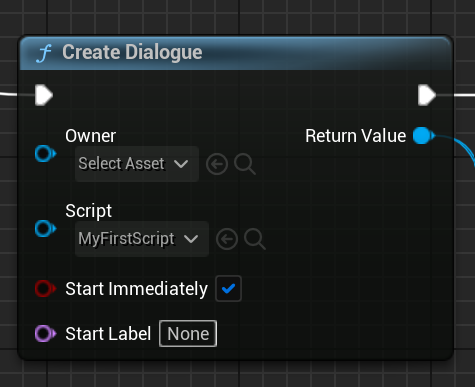
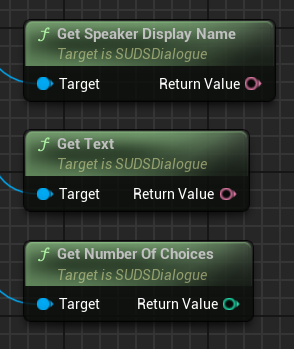
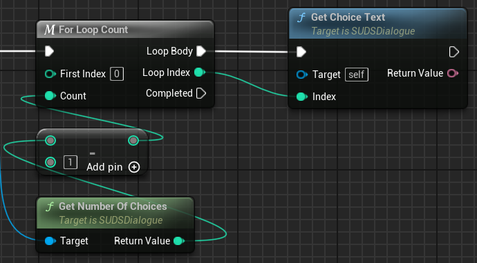
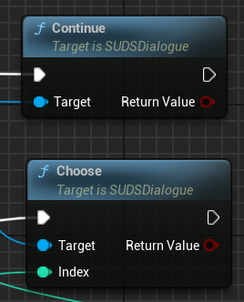
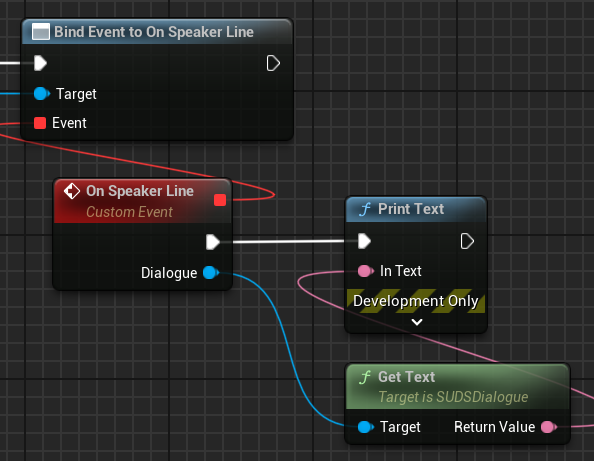

# Running Dialogue

Writing a [script](ScriptReference.md) is one half of using SUDS, the other is
running that script via a Dialogue Instance. 

> Note: if you just want to test your script, and not have to hook the dialogue 
> up in your game yet, see [Testing Your Dialogue](Testing.md).

To create a dialogue in game, use one of the `CreateDialogue` methods, for example: 



In C++, this is:

```c++
USUDSLibrary::CreateDialogue(this, MyFirstScript, true);
```

The "Create Dialogue" node creates a runtime dialogue from the script,
and  immediately starts it from the beginning. This causes the dialogue to start
running lines from the top, and when it hits a speaker line it stops (there
are delegates you can use to be notified of and influence this).

You can also call `CreateDialogueWithParticipants` to create a dialogue with a
set of [Participants](#participants) already configured.

## Starting Dialogue

You can tell a dialogue to start immediately on creation, which means it starts
and runs to the first speaker node immediately. Alternatively, you can set
Start Immediately to false, and manually call `Start` when you're ready. This
could be because you want to set some initial [variable state](Variables.md),
or [restore state](SavingState.md#restoring-dialogue-state) from a previous run. 

## Dialogue Owners

The `CreateDialogue` function asks for an owner of the dialogue; this is important
to determine the lifecycle of the dialogue. You *can* leave the owner as null,
but it means the dialogue is owned by the temporary package, which you probably don't want.

Ideally your dialogue instances should be owned by some actor which you're talking
to, such as an NPC. This means the dialogue, at the latest, unloads when they do.

This can also be useful for [saving dialogue state](SavingState.md) since this NPC
can include the saved dialogue state in their own saved state.

## Stepping Through Dialogue

Dialogue always pauses at [speaker lines](SpeakerLines.md). From here you can 
access:

* The speaker ID / display name
* The speech text (or [voiced dialogue](VoicedDialogue.md))
* Whether there are choices, and if so what those choices are





If there are no choices, you can progress the dialogue just by calling `Continue()`.
Otherwise, you'll want to get the text of each choice and then when the player
chooses one, you call `Choose(ChoiceIndex)` to progress:



Once you've progressed the dialogue, it will either have ended (denoted by
both the return value from `Choose` / `Continue`, and by the `IsEnded` function),
or it will have paused on a new speaker line. Then you repeat the same thing again.

> Tip: you can ask SUDS whether a choice has been taken before, using 
> the `HasChoiceBeenTakenPreviously` function. However it relies on 
> [Localisation Text IDs](Localisation.md#text-identifiers) if you want to keep
> it across script edits.

## Variables

You can change variables any time you want while running dialogue. 
See the [Variables section](Variables.md) for more details on how this works.

However, the dialogue only "runs" between `Start` or `Continue`/`Choose` and
the next [speaker line](SpeakerLines.md), so your changes will only take effect
then.

## Participants

Participants are objects which are closely involved in the running of the dialogue,
providing variables to it (and potentially reading them back), and receiving
[events](EventLines.md).

The most common participants are objects representing the characters you're talking
to, and your own player character, but you can add as many as you like. 

See the [Participants section](Participants.md) for more details.

## Events

Any other objects can bind to delegates on the dialogue to receive notifications
of activity on the dialogue. It's recommended you only use this for things
that simply observe the dialogue, such as a dialogue UI perhaps.



For objects which send variables to the dialogue and are otherwise more closely
involved, it's recommended to use [Participants](#participants) instead.

## SUDS Example Project

If you want to see a fully worked example of using SUDS in practice, see
the [SUDS Example Project](https://github.com/sinbad/SUDSExample).


---

### See Also:
* [Variables](Variables.md)
* [Testing Scripts](Testing.md)
* [Voiced Dialogue](VoicedDialogue.md)
* [Script Reference](ScriptReference.md)
* [Localisation](Localisation.md)
* [SUDS Example Project](https://github.com/sinbad/SUDSExample)
* [Full Documentation Index](../Index.md)