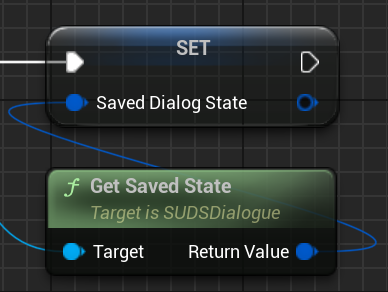
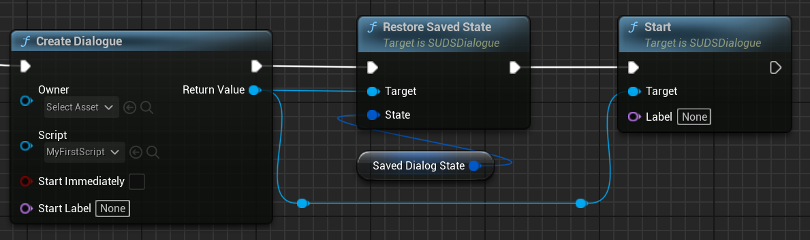
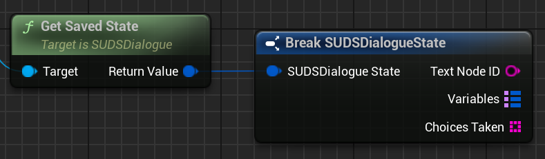

# Saving and Restoring State

## Dialogue State

Every [runtime dialogue](RunningDialogue.md) has a set of active state which comprises 3 things:

* The state of all [variables](Variables.md)
* The current speaker line
* The set of choices which have been taken before

If you want dialogue state to persist between times when the dialogue instance itself 
doesn't - either if you dispose of your dialogue instances once the UI closes, or
across save games, you need access to that state so you can store it somewhere,
and include it in your save game.

### Extracting Dialogue State

To get a snapshot of dialogue state, call `GetSavedState` on the dialogue instance. You
could just save this in a property on the 
[owner of the dialogue](RunningDialogue.md#dialogue-owners), for example:

If you mark this property "Save Game", then most save game systems (such as [SPUD](https://github.com/sinbad/SPUD))
will be able to serialise it along with the rest of your save game data.

### Restoring Dialogue State

When you [run the dialogue](RunningDialogue.md), instead of just immediately 
starting it, call `RestoreSavedState` first, like this:

`RestoreSavedState` will restore the active speaker node as well, in case you
saved in the middle of the dialogue. 

### Examining Dialogue State

If you want you can dig into the dialogue state:

It contains: 

* Variables A map of variables by name

* Choices Taken: The set of choices that have been picked before (e.g. so you can 
    mark choices the player has already taken)

* Text Node ID: this is the speaker line which the dialogue was on when the state
  was retrieved. 

> It's important to note that Text Node ID and the Choices Taken use the
> [String Keys](Localisation.md#string-keys) associated with the speaker
> line or choice, which are also used for [Localisation](Localisation.md). 
>
> These identifiers are usually generated at import time, but
> will only be constant through later edits of the [script](ScriptReference.md) 
> if those IDs are [added back to the script](Localisation.md#writing-text-ids-to-script) itself.
> These IDs do clutter the script so it's nicer to omit them while going through
> writing and editing cycles. 
>
> It's best not to rely on saving mid-dialogue 
> or having reliable choice highlighting across save games while your dialogue is
> in active development, until you get to the point when your script is mostly finished,
> and you're ready to [localise it](Localisation.md).

## Global State

You may also be using [global variables](Variables.md#global-variables),
and want to save the state of those variables.

To do so, get a reference to the `SUDSSubsystem` and use the same kind of functions as
dialogues, but the Global versions, e.g. `GetSavedGlobalState`, `RestoreSavedGlobalState`.

## Using SPUD

One of the easiest ways to handle saved dialogue in save games is via one of my
other projects, [SPUD](https://github.com/sinbad/SPUD). 

### Dialogue State

Assuming that you've made the [owner of the dialogue](RunningDialogue.md#dialogue-owners)
the NPC you're talking to, and that NPC is already registered as a SPUD Object,
simply having a property marked as "Save Game" with the dialogue state from `GetSavedState`
in it will automatically save that state too.

You still need to populate it by calling `GetSavedState`, which you can either do
at the end of the dialogue (if the NPC is a [Participant](Participants.md) this is
easy, use the `OnDialogueFinished` callback), or if you can save mid-dialogue then
use the `ISPUDObjectCallback::SpudPreStore` hook.

### Global State

Global state will need to be stored in a `SaveGame` property of a UObject which
is registered with SPUD via `AddPersistentGlobalObjectWithName`. You can extract
the state from SUDS using `SUDSSubsystem`'s `GetSavedGlobalState` method, and
restore it after load using `RestoreSavedGlobalState`. 

---

### See Also
 
* [Variables](Variables.md)
* [Script Reference](ScriptReference.md)
* [Localisation](Localisation.md)
* [Running Dialogue](RunningDialogue.md)
* [Full Documentation Index](../Index.md)