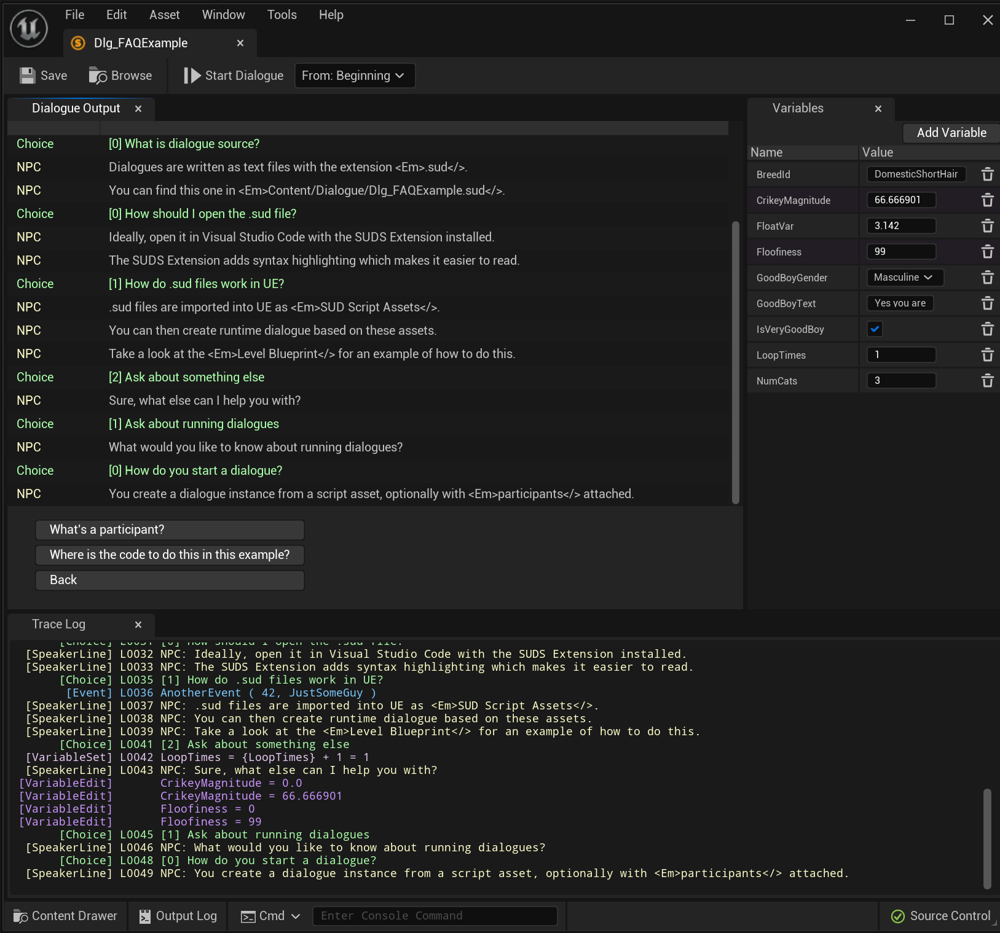
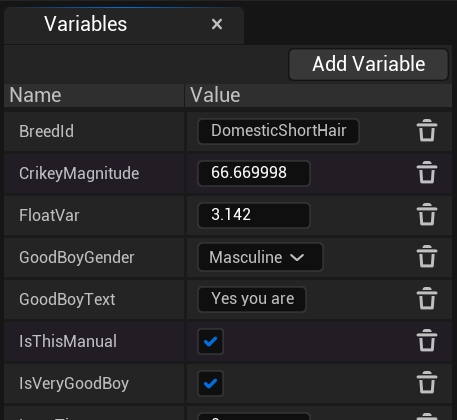

# Testing Your Script

While you've [writing your script](ScriptReference.md), you're probably going to 
want to test it, to see how it flows in practice, and make sure any conditional 
logic behaves as you expect.

While you can of course [run dialogue](RunningDialogue.md) in your game, a quicker
and more convenient way of testing before you get to that stage is to use the 
*in-editor dialogue testing* feature.

## Opening the Editor Runner

To open the editor runner, you only need to double-click a SUDS Script Asset.
The window has a few areas:

## Starting the Dialogue

The toolbar is where you can find the "Start Dialogue" button. This (re)starts
the dialogue from the label shown in the drop-down box to the right of it. 

This defaults to starting the dialogue from the beginning, but you can start from
any [label](GotoLines.md#label-lines) defined in the script. This can be handy
if you use combined scripts for lots of smaller interactions and just start the
dialogue from the appropriate section, rather than having lots of separate scripts.

## Output & Choices

Once the dialogue is running, you'll see speaker lines displayed in the Dialogue
Output tab. Buttons will appear at the bottom of this tab for you to make
choices, or simply continue the dialogue.

## Trace Log

The trace log at the bottom shows everything the dialogue output window does, plus
additional information about which line is being executed, what changes are being
made to variables, and what conditional lines are evaluated and what the outcome
was. The trace log is very useful for debugging what's happening in your dialogue.

## Variable Tab

The variables tab shows the current [variable state](Variables.md) for the dialogue.
It's editable, so you can change any variable values on the fly if you want, 
to simulate different scenarios.

Variables which are set in the script appear here automatically, but you can 
also manually add variables as well. This is usually variables which would 
be supplied by code while the game is running, but you can hack them in here for testing.

Any variables you add manually will have a slightly purple colour tint:

Variables you manually add will not be cleared when you restart the dialogue, unlike
the rest of dialogue state. This is so you can re-run the dialogue multiple times
and not have to keep manually setting up the state every time.

---

### See Also:
* [Variables](Variables.md)
* [Running Dialogue](RunningDialogue.md)
* [Script Reference](ScriptReference.md)
* [Localisation](Localisation.md)
* [SUDS Example Project](https://github.com/sinbad/SUDSExample)
* [Full Documentation Index](../Index.md)