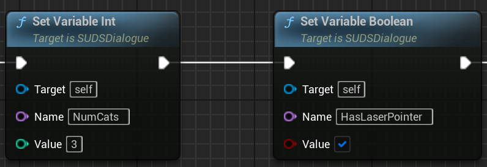
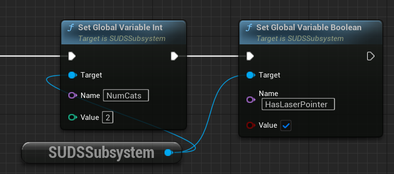
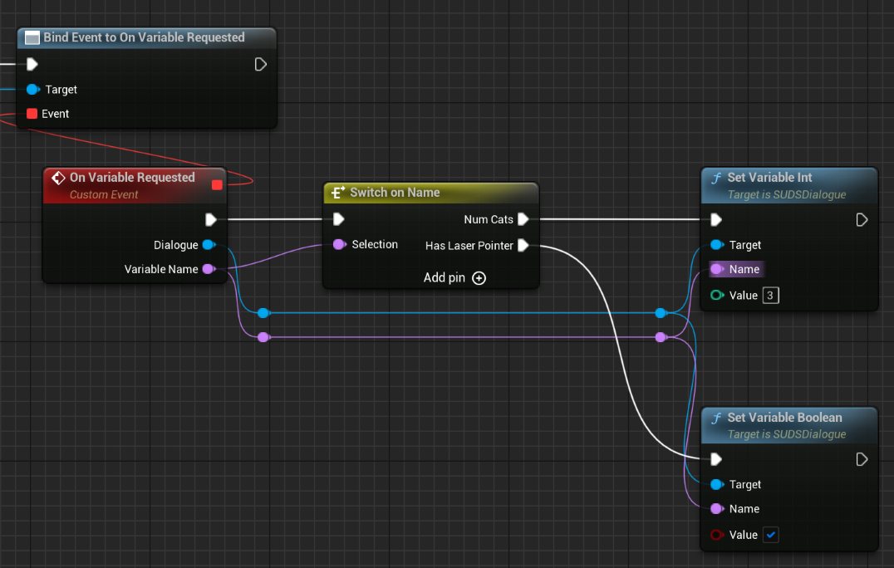

# Variables

You can set variables to keep track of decisions made inside a dialogue, or to
pass state in and out of dialogues from your wider code (C++ or Blueprints). 

There are 2 scopes for variables, [dialogue scope](#dialogue-variables) and
[global scope](#global-variables).

## Dialogue Variables

Every [runtime instance](RunningDialogue.md) of a script (also called a Dialogue)
has a pool of variable memory, which is stored simply as a set of name/value pairs.

When you [set a variable](#setting-variables) value on a dialogue instance,
either in script or in code, it is added to this variable memory, which persists
all the time the dialogue exists, and can be
[saved](SavingState.md).

* All variables are ***shared*** across the entire script; indenting does not matter
* Variable state does not outlive the dialogue instance, unless you [save them](SavingState.md)
* Variable names are ***case insensitive***.
* Variable names can contain:
	* Letters (a-z, A-Z)
	* Numbers (0-9)
	* Underscores (_)
	* Periods (.)
* Variable names must **not** use the prefix `global.`, which is reserved for [global variables](#global-variables)

Variables are ***flexibly typed***, which means you can assign any of the 
[supported types](#supported-types) to them.

## Global Variables

There also exists a pool of **global variables** which are shared across all 
dialogue instances. If you have some common variable state that you don't want
to set up every time you start a dialogue instance, or if you want changes made
to a variable inside a dialogue instance to be available to other dialogues later,
then you might want to use global variables. The alternative is to pass variable state
in/out of individual dialogue instances as you start / finish them.

In script, global variables are simply variables which have the prefix `global.`.
In C++ and Blueprints, there is a separate API for setting global variables,
see [Setting Variables](#setting-variables).


## Supported Types

| Type | Unreal Type | Notes |
|------|-------------|-------|
| Integer | int32 | Whole numbers between -2,147,483,648 and 2,147,483,647.|
| Float | float | Single-precision floating point numbers. Literals must contain a decimal point. |
| Boolean | bool | Literals can be `true` or `false`|
| Text | FText | Literal values are enclosed in double-quotes (`"Text"`) and are localised|
| Name | FName | Literal values are enclosed in backticks (`` `Name` ``), no localisation|
| Gender | ETextGender | Literals can be `masculine`, `feminine` or `neuter`


## Setting Variables

### Setting Variables In Script

This is done via [Set lines](SetLines.md).

### Setting Variables In Code

You set dialogue variables in code by calling one of the dialogue's `SetVariable` methods.
You set global variables using the `SUDSSubsystem`'s `SetGlobalVariable` methods.

### Blueprints

For dialogue variables, Blueprints have a specific variant of `SetVariable` for each of the supported types,
for example: 



For global variables, use the `SUDSSubsystem`'s `SetGlobalVariable` methods.



> Note that you don't use the "global." prefix on the name when setting from Blueprints / C++

### C++

From C++ you can call these type-specific methods too, or you can call a
universal templated version which will determine the type automatically.
For dialogue variables:

```c++
Dlg->SetVariable("NumCats", 3);
Dlg->SetVariable("HasLaserPointer", true);
```

For global variables:

```c++
auto SUDS = GetSUDSSubsystem(WorldContext);
SUDS->SetGlobalVariable("NumCats", 2);
SUDS->SetGlobalVariable("HasLaserPointer", true);
```


### On-Demand Dialogue Variable Setting

While the simplest way to get state from surrounding code into the dialogue 
is to do a one-time set of calls to SetVariable at creation of
the dialogue, or using global variables, sometimes you might want to let the dialogue have access to state
on demand. Perhaps the state is volatile and changes during the dialogue.

To do this, you can hook into the `OnVariableRequested` event on the [runtime dialogue](RunningDialogue.md)
instance, or implement `OnDialogueVariableRequested` on a [Participant](Participants.md).

The event version might look something like this in Blueprints:



Or in C++ the Participant version might be:

```c++
void ANPC::OnDialogueVariableRequested_Implementation(USUDSDialogue* Dlg, FName VarName)
{
	static const FName NumCats("NumCats");
	static const FName HasLaserPointer("HasLaserPointer");
	if (VarName == NumCats)
	{
		Dlg->SetVariable(Numcats, 3);
	}
	else if (VarName == HasLaserPointer)
	{
		Dlg->SetVariable(HasLaserPointer, true);
	}
}
```

## Getting Variable Values

### Referencing in script

You can refer to the value of variables in many ways in the script.

In [Speaker](SpeakerLines.md) and [Choice](ChoiceLines.md) lines, you can substitute
[variables](Variables.md) into the text using curly braces, for example:

```yaml
NPC: Wow, look at that {Thing}!
NPC: There are {global.NumCats} cats!
```

Any variable prefixed with `global.` is a [global variable](#global-variables), 
all other variables are [dialogue variables](#dialogue-variables).

See [Text Markup](TextMarkup.md) for more details.

You can also use them in [Expressions](Expressions.md) in both [Set lines](SetLines.md)
and [Conditional lines](ConditionalLines.md).

### Getting from Code

You can retrieve the value of any variable by calling one of the `GetVariable`
methods. Like `SetVariable` they have variants for each of the [supported types](#supported-types).

However if for some reason you do not know the type you can call the generic 
`GetVariable` and receive the flexible type version, which is of type `FSUDSValue`.

You can determine the type from that and retrieve the actual value, both in 
C++ and Blueprints, for example:


You can also get global variables from the `SUDSSubsystem` in the same way
as [setting variables](#setting-variables-in-code) above.

### Uninitialised Variables

#### In Expressions Or Conditionals

If you use the value of a variable which has not been set in expressions like
`{SomeValue} + 1`, you get a default value depending on the context. 

If you're doing a boolean test you get false, if numeric you get 0, and for text 
you get a blank string. This is so that expressions never fail to evaluate, so they
don't break your script.

#### In Text

If you output an uninitialised variable in text, then you get just the original
text, unsubstituted. For example if you had a speaker line that said
`NPC: So you want {Count}?`, and `Count` is undefined, then that line will be
printed verbatim, rather than substituting the default 0. This is because you 
basically never want to rely on defaults when outputting text to a player, so
printing the unsubstituted variable name makes it easier to detect a bug like this. 

---

### See Also
 
* [Set lines](SetLines.md)
* [Expressions](Expressions.md)
* [Saving State](SavingState.md)
* [Script Reference](ScriptReference.md)
* [Localisation](Localisation.md)
* [Running Dialogue](RunningDialogue.md)
* [Full Documentation Index](../Index.md)