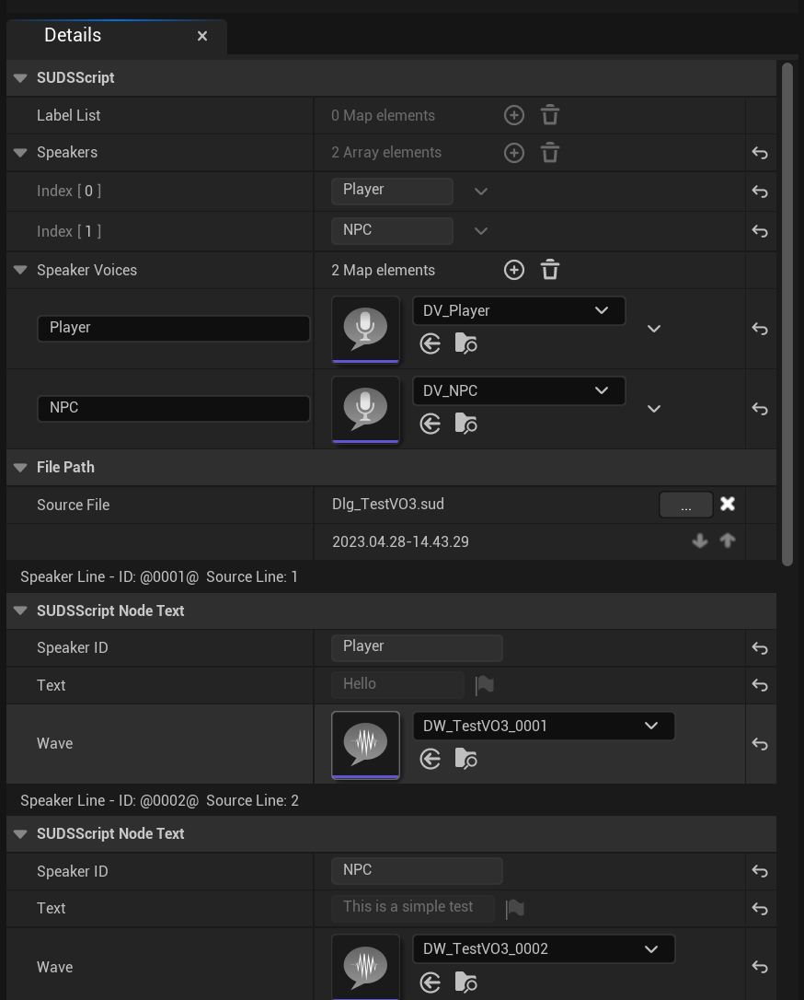

# Voiced Dialogue

A lot of the functions of SUDS are suited to a text-based dialogue system, but you
can use fully voiced lines as well if you want. Obviously you lose the ability
to [parameterise](Variables.md) parts of voiced text, since it's pre-recorded, 
but everything else works the same way.

> Only [speaker lines](SpeakerLines.md) can be voiced; choices are always text.
> If you need a character to read out the choice once it's selected, just add
>a speaker line for the choice path; this also means the spoken version can be longer
>than the abbreviated choice text.

## Voice Assets: a quick tour

Unreal deals with voiced dialogue via the Dialogue Voice and Dialogue Wave assets;
see the [official documentation](https://docs.unrealengine.com/5.1/en-US/using-dialogue-voices-and-waves-in-unreal-engine/) for full details but we'll
quickly explain them here.

Dialogue Voice assets correspond to speakers. They're mostly just a placeholder,
but also define the gender and plurality of the speaker for informational purposes.

Dialogue Wave assets correspond to individual lines of dialogue. Wave assets are 
linked to Sound Wave assets for the actual audio. They are also linked back to the
voice of the speaker, and optionally the target - it's possible to define multiple
speaker/target contexts and use different audio for each, but in the case of SUDS
that's rarely required, since the context is usually singular.

So in SUDS, when using voice assets there will be one Dialogue Voice for each 
speaker in a script, and one Dialogue Wave for each line.

## Generating Voice Assets

SUDS can generate voice assets for you. Obviously we can't generate the audio
for you (!), but we can generate the voice and wave assets, and link them into your
scripts, ready for you to flesh them out with actual voice audio later.

However, before you do that, you need to consider a couple of things:

### Prepare your scripts

Because generating voice assets creates a *lot* of additional linked assets, you
don't want to do it until your scripts are pretty stabilised. Every line will
generate a Dialogue Wave asset, and while you *can* repeat the process and it will
overwrite previously generated assets, you don't really want to be doing it until
you're fairly sure your script is basically done.

The other thing to realise is that if you do need to alter your script afterwards,
and particularly if you add or remove lines, it's vital that the identifiers for each speaker line 
continue to match up with Dialogue Waves that were previously generated. This is
the same issue as [localisation](Localisation.md), and has the same solution:
you really should use the ["Write Back String Keys"](Localisation.md) function
before generating voice assets, so that your script knows what the string key
for every line is. Just like for localisation, you want to do this late in the
writing process so that you don't have to clutter your script with string keys,
but it's preferable to do it before generating voice assets. It's not quite as
vital as doing it before localisation, but bear in mind you might have to delete
and recreate your voice assets after a script update if you don't.

### Configure settings

The other thing you need to do is check your project settings to define where you want
the assets to be created. 

Go to Project Settings > SUDS Editor:

* **Dialogue Voice Asset Location**: Where to generate dialogue voice assets. Recommend
leaving this set Shared Directory, that way whenever you use the same speaker ID
across multiple scripts, they will all refer to the same dialogue voice asset
* **Dialogue Voice Asset Shared Dir**: Pick the shared directory where voice assets are created
* **Dialogue Wave Asset Location**: Where to store dialogue wave assets. There will be a lot
more of these, so it's a good idea to use one of the "Subdir" options so that all
waves for a single script are contained in a subdirectory. You can put them in a single
shared directory, or alongside the script that generated them.
* **Dialogue Wave Asset Shared Dir**: Set this if you've chosen to use a shared directory for waves
* **Dialogue Voice Asset Prefix**: The prefix to give dialogue voices when generating them.
* **Dialogue Wave Asset Prefix**: The prefix to give dialogue waves when generating them.
* **Strip Script Prefixes when Generating Names**: When using the script name to generating
subdirs or wave names, whether to strip characters before the first "_" so as not to
repeat the script prefix in the name (recommended)

> **Advanced Settings**
> Here you can find options to auto-generate voice assets on import, either for
> all scripts, or only ones in certain folders. I don't recommend you enable 
> these, since most likely you'll be going through multiple round-trips with 
> your scripts, and generating voice assets every time is likely a waste of time,
> and may even leave asset clutter you don't need should you do major edits.

### Generating voice assets

There are 2 ways to do this; in bulk, or individually.

Bulk generation: right-click one or more 
SUDS scripts and click "Generate Voice Assets":

Single script: When you have a SUDS script asset open in the editor, where
you can [run the script for testing](Testing.md), click the "Generate Voice Assets" button
in the toolbar.

After generating voice assets, you'll have Dialogue Voice assets like "DV_SpeakerID"
for each speaker, and lots of Dialogue Wave assets. Your script assets will also
be updated to reference these assets, which you can see in the Details pane when
opening a script asset in UE:

These asset links are editable, so if you decide to replace some of these assets
with your own, or even remove a wave asset for a particular line, you can do so.

## Completing the assets

SUDS can only generate template assets, you'll need to edit these assets to 
be able to play them.

### Dialogue Voice

Dialogue Voice assets simply need to be edited to provide gender and plurality:

### Dialogue Wave

Dialogue Wave assets are where most of the work you need to do is.

SUDS generates a Dialogue Context for you when creating the Dialogue Wave;
it only has the Speaker, and not the Directed At section completed, but you don't
actually need the latter.

Expanding the context, you can see the space for the Sound Wave, which is where
you need to plug in the Sound Wave asset containing your voiced dialogue.

> **Naming conventions**: When generating the  Dialogue Wave, the file name is
> generated from the prefix (DW_ by default), the name of the script (TestVO3),
> and the string key of the speaker line. This is why it's preferable to have
> written the string keys back to the script before generating these assets, then
> the link remains reproducible.

#### Spoken Text Field

SUDS automatically fills in the Spoken Text field, so it makes it easier to identify
the line without having to look up the string key. By default, this is what Unreal
uses if you enable its built-in subtitles feature.

However, because this is a plain FString, it doesn't link with the string table 
version of the line which SUDS normally uses; it's effectively a copy.
If you're doing your own subtitles, you can choose between using subtitle text from
Dialogue Wave, or using GetText() from the SUDS dialogue (which uses the string
table). They'll always be the same for the primary language, but you should bear
in mind that they are [localised separately](Localisation.md), so to avoid duplication
you should pick one or the other and use that through your localisation process.

> It's unfortunate that UE decided to make SpokenText FString rather than FText,
> and separating the localisation process. There's not much we can do to unify this,
> since if you choose to use their built-in subtitles it has to use this separate
> text version. I guess it also unifies the translation for the audio and spoken
> version into one place, which is helpful if the actor improvises changes to the line.
> Just be careful to pick your source of subtitles knowing the implications.

## Playing Voice Lines

When deciding how to process the current dialogue line, you can check for
voiced lines using "Is Current Line Voiced", and if so play the audio, like this:

You can also use "Play Voiced Line at Location" if you want to place the voice in
real space.

### Voice concurrency

By default only one voiced line will be played at a time, so if you advance dialogue
before a line is finished playing and another one is played, it will interrupt
the previous one. The settings for this are persistent across all dialogues.

To allow more voiced lines to be played at once, use `SUDSSubsystem`:

### See Also:
* [Speaker Lines](SpeakerLines.md)
* [Localisation](Localisation.md)
* [Script Reference](ScriptReference.md)
* [Running Dialogue](RunningDialogue.md)
* [Full Documentation Index](../Index.md)