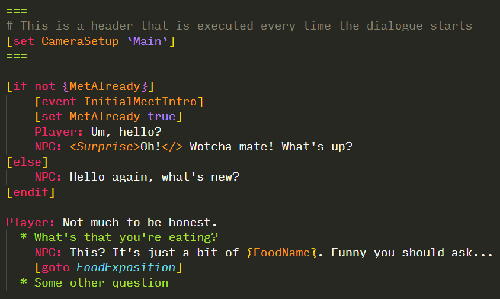

# SUDS Visual Studio Code Extension

The best way to use SUDS is to install the [Visual Studio Code Extension](https://marketplace.visualstudio.com/items?itemName=sstreeting.suds-code). 

The extension primarily provides syntax highlighting and makes it much easier to write
scripts accurately, and to skim read them afterwards. 

You can find the extension on the VSCode Marketplace by just searching for "SUDS".

As a comparison, here's what the same script looks like with & without the
extension:

Without the extension:

```
===
# This is a header that is executed every time the dialogue starts
[set CameraSetup `Main`]
===

[if not {MetAlready}]
    [event InitialMeetIntro]
    [set MetAlready true]
    Player: Um, hello?
    NPC: <Surprise>Oh!</> Wotcha mate! What's up?
[else]
    NPC: Hello again, what's new?
[endif]

Player: Not much to be honest.
  * What's that you're eating?
    NPC: This? It's just a bit of {FoodName}. Funny you should ask...
    [goto FoodExposition]
  * Some other question
```

With the extension:




---

### See Also
 
* [Script Reference](ScriptReference.md)
* [Running Dialogue](RunningDialogue.md)
* [Full Documentation Index](../Index.md)
